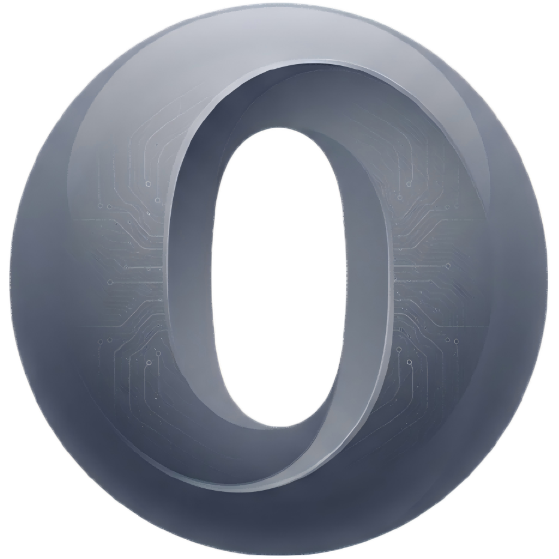

<p align="center">
  
</p>

<h1 align="center">USA零</h1>

<p align="center">
  <a href="https://usa0.top">官网</a> ·
  <a href="https://github.com/tkxs/Zero-canvas">GitHub</a> ·
  Q群：1084450051
</p>

USA零是一款面向图片创作的开源工作台，把画布编排、AI 图片生成、参考图编辑、对话助手、提示词库和素材沉淀放在同一个界面中，适合连续探索和迭代视觉方案。

> [!CAUTION]
> 项目目前处于开发阶段，不保证历史数据兼容。AI API Key、画布、素材和生成记录默认保存在浏览器本地，浏览器会直接请求用户配置的 OpenAI 兼容接口。

## 核心功能

- 多画布项目、节点拖拽缩放、连线、小地图、撤销重做和导入导出。
- 文生图、图生图、参考图编辑、文本、音频和视频生成。
- 提示词库、素材管理、生成记录和 WebDAV 同步。
- 通过本机 Canvas Agent 连接 Codex / Claude Code，并使用 MCP 操作当前画布。
- 支持动态安装节点插件，并提供 TypeScript 插件 SDK。
- 支持自定义模型调用脚本，适配不同 OpenAI 兼容接口。

## 快速开始

```bash
git clone https://github.com/tkxs/Zero-canvas.git
cd Zero-canvas/web
bun install
bun run dev
```

Docker：

```bash
git clone https://github.com/tkxs/Zero-canvas.git
cd Zero-canvas
docker compose up -d
```

默认访问地址为 `http://localhost:3000`。首次打开后进入右上角配置，填写自己的 `Base URL`、`API Key` 和模型名。

## 文档

- [快速开始](docs/content/docs/overview/quick-start.zh-CN.mdx)
- [功能介绍](docs/content/docs/overview/features.zh-CN.mdx)
- [Docker 部署](docs/content/docs/overview/docker.zh-CN.mdx)
- [画布节点操作手册](docs/content/docs/canvas/canvas-node-manual.zh-CN.mdx)
- [本地 Canvas Agent](canvas-agent/README.md)
- [Codex App 插件](plugins/infinite-canvas/README.md)
- [待办事项](docs/content/docs/progress/todo.zh-CN.mdx)

## 官方入口

- 官网：<https://usa0.top>
- Q群：`1084450051`
- GitHub：<https://github.com/tkxs/Zero-canvas>

## 开源协议

本项目使用 [MIT License](LICENSE)。
